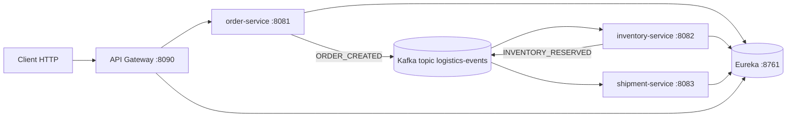

# Micro Demo Kafka - Documentation Complete

## 1) Idee du projet

Ce repository presente une idee de plateforme logistique en microservices, basee sur:

- Spring Boot 3 (Java 17)
- Spring Cloud (Eureka, Gateway, Config Server)
- Apache Kafka pour la communication asynchrone
- Docker Compose pour Kafka + Zookeeper

Le but est de montrer un workflow metier event-driven simple:

1. Un client cree une commande.
2. Le service de stock reserve (ou refuse) les quantites.
3. Le service d'expedition prepare l'envoi ou place la commande en attente.

Le projet privilegie la clarte pedagogique: stockage en memoire, JSON simple sur Kafka, APIs lisibles.

## 1.1) Vision metier (Business Logic)

Logistics Flow Platform est une plateforme de suivi logistique qui transforme une commande client en livraison preparee, avec controle automatique du stock.

### Objectif metier

- Reduire les retards de preparation
- Eviter les commandes validees sans stock disponible
- Donner une visibilite claire sur l'etat des commandes

### Probleme adresse

Dans une chaine logistique, les equipes perdent du temps quand:

- La commande est validee sans verifier le stock
- Les informations sont dispersees entre plusieurs outils
- Les blocages sont detectes trop tard

La plateforme centralise ces etapes pour accelerer le traitement.

### Logique metier de bout en bout

1. Creation de commande
  Le service enregistre la commande du client (produit, quantite, client).
2. Verification du stock
  Le systeme verifie automatiquement si la quantite demandee est disponible.
3. Decision de reservation
  Si le stock est suffisant, la commande est confirmee; sinon, elle est refusee ou mise en attente.
4. Preparation de la livraison
  Les commandes confirmees passent en preparation de livraison.

### Regles metier principales

- Une commande doit contenir un produit valide, une quantite positive et un client
- Le stock ne peut jamais devenir negatif
- Une livraison ne peut etre preparee que si la reservation est validee
- Chaque etape produit un statut clair pour le suivi operationnel

### Valeur pour les equipes

- Service client: reponse rapide sur la faisabilite d'une commande
- Operations: moins de taches manuelles et moins d'erreurs
- Management: vue en temps reel sur les flux et les blocages

### Indicateurs metier a suivre

- Nombre de commandes recues
- Taux de commandes confirmees
- Taux de commandes refusees pour manque de stock
- Nombre de livraisons en preparation
- Nombre de commandes en attente

## 2) Architecture globale

### Services et roles

| Service | Port | Role |
|---|---:|---|
| config-server | 8880 | Serveur de configuration centralise (source Git distante) |
| discovery-service | 8761 | Registre Eureka pour la decouverte de services |
| api-gateway | 8090 | Point d'entree HTTP unique, routage vers les services metiers |
| order-service | 8081 | Creation et consultation des commandes |
| inventory-service | 8082 | Reservation de stock apres evenement de commande |
| shipment-service | 8083 | Creation des expeditions apres reservation de stock |
| kafka + zookeeper | 9092 / 2181 | Bus d'evenements et coordination broker |

### Flux metier (haut niveau)



## 3) Communication evenementielle Kafka

Topic principal utilise: `logistics-events`

### Evenement 1: ORDER_CREATED (emis par order-service)

Exemple de payload:

```json
{
  "event": "ORDER_CREATED",
  "orderId": 1,
  "sku": "SKU-001",
  "quantity": 2,
  "customerName": "Alice",
  "timestamp": "2026-04-17T10:15:30Z"
}
```

### Evenement 2: INVENTORY_RESERVED (emis par inventory-service)

Exemple de payload:

```json
{
  "event": "INVENTORY_RESERVED",
  "orderId": 1,
  "reservationId": 1,
  "sku": "SKU-001",
  "quantity": 2,
  "status": "RESERVED",
  "accepted": true,
  "timestamp": "2026-04-17T10:15:31Z"
}
```

Le shipment-service consomme ces evenements et cree un enregistrement:

- status `PREPARING` si `accepted=true`
- status `ON_HOLD` si `accepted=false`

## 4) APIs exposees

Les appels externes passent de preference par le Gateway (`http://localhost:8090`).

### Order service

- `POST /orders` : creer une commande
- `GET /orders` : lister les commandes
- `GET /orders/{id}` : detail d'une commande

Exemple de requete:

```bash
curl -X POST http://localhost:8090/orders \
  -H "Content-Type: application/json" \
  -d '{"sku":"SKU-001","quantity":2,"customerName":"Alice"}'
```

### Inventory service

- `GET /inventory` : stock global
- `GET /inventory/{sku}` : stock d'un SKU
- `GET /inventory/reservations` : reservations traitees
- `POST /inventory/{sku}/restock?quantity=10` : reapprovisionnement

### Shipment service

- `GET /shipments` : liste des expeditions
- `GET /shipments/{id}` : detail expedition

## 5) Prerequis

- Linux/macOS/WSL recommande
- Java 17
- Docker + Docker Compose
- curl (pour les tests HTTP)

## 6) Demarrage rapide

Depuis la racine `micro-demo-kafka`:

```bash
chmod +x start-all.sh stop-all.sh
./start-all.sh
```

Le script:

1. demarre Kafka + Zookeeper via Docker Compose
2. cree le topic `logistics-events` (si absent)
3. demarre config-server, puis discovery-service
4. demarre order/inventory/shipment
5. demarre api-gateway
6. ecrit les logs dans `./logs` et les PID dans `./.services.pids`

Verifications utiles:

- Gateway: http://localhost:8090
- Eureka: http://localhost:8761
- Config Server: http://localhost:8880

Arret global:

```bash
./stop-all.sh
```

## 7) Scenario de demo de bout en bout

1) Creer une commande

```bash
curl -X POST http://localhost:8090/orders \
  -H "Content-Type: application/json" \
  -d '{"sku":"SKU-001","quantity":2,"customerName":"Alice"}'
```

2) Verifier la reservation de stock

```bash
curl http://localhost:8090/inventory/reservations
curl http://localhost:8090/inventory/SKU-001
```

3) Verifier la creation d'expedition

```bash
curl http://localhost:8090/shipments
```

## 8) Commandes Kafka utiles

Les details sont aussi disponibles dans `commande-kafka.md`.

```bash
docker exec -it kafka bash

# Lister les topics
kafka-topics --list --bootstrap-server localhost:9092

# Consommer les evenements
kafka-console-consumer --bootstrap-server localhost:9092 --topic logistics-events --from-beginning
```

## 9) Execution manuelle service par service

Si vous ne voulez pas utiliser `start-all.sh`:

```bash
docker compose up -d

cd config-server && ./mvnw spring-boot:run
cd ../discovery-service && ./mvnw spring-boot:run
cd ../order-service && ./mvnw spring-boot:run
cd ../inventory-service && ./mvnw spring-boot:run
cd ../shipment-service && ./mvnw spring-boot:run
cd ../api-gateway && ./mvnw spring-boot:run
```

## 10) Tests

Exemples:

```bash
cd order-service && ./mvnw test
cd ../inventory-service && ./mvnw test
cd ../shipment-service && ./mvnw test
cd ../api-gateway && ./mvnw test
cd ../config-server && ./mvnw test
cd ../discovery-service && ./mvnw test
```

## 11) Limites actuelles

- Stockage 100% en memoire (pas de base de donnees)
- Pas d'authentification/autorisation
- Pas de tracing distribue ni metrics avancees
- Topic unique pour simplifier la demo
- Le Config Server est disponible, mais les services utilisent actuellement leurs propres `application.yml`

## 12) Pistes d'amelioration

- Ajouter PostgreSQL pour persister commandes, stock, expeditions
- Ajouter OpenAPI/Swagger pour chaque service
- Ajouter Spring Security + JWT
- Ajouter observabilite (Micrometer + Prometheus + Grafana)
- Ajouter tests d'integration multi-services (Testcontainers + Kafka)
- Separer les topics par domaine (`orders`, `inventory`, `shipments`)

## 13) Structure du repository

```text
micro-demo-kafka/
  api-gateway/
  config-server/
  discovery-service/
  order-service/
  inventory-service/
  shipment-service/
  docker-compose.yml
  start-all.sh
  stop-all.sh
  commande-kafka.md
```

## 14) Resume

Cette base de code illustre une architecture microservices simple mais representative:

- entree unique via Gateway
- decouverte via Eureka
- orchestration asynchrone via Kafka
- separation claire des responsabilites metier

C'est une bonne base pour un POC, une demo de cours, ou une evolution vers un systeme production-ready.